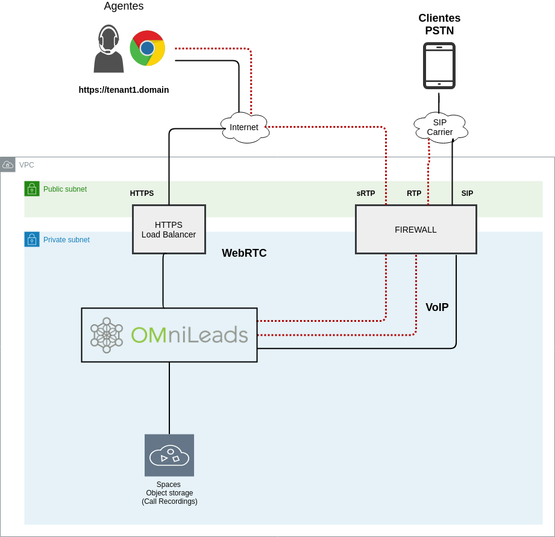
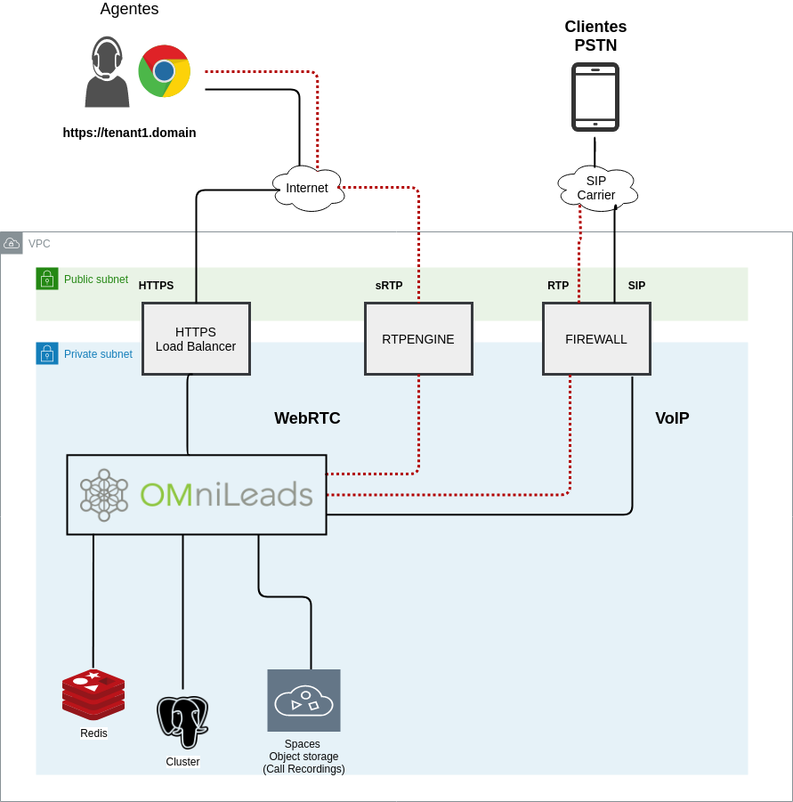
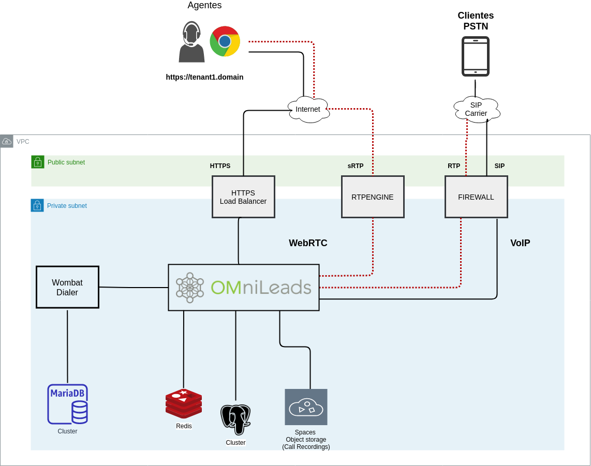
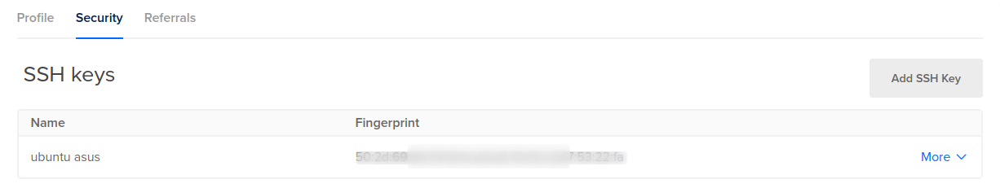

# omnileads-digitalocean
Deploy your own Contact Center as a Service business on Digitalocean with OMniLeads & Terraform

<p>OMniLeads (OML) is an Open Source software solution based on WebRTC technology(https://webrtc.org/) designed to support the management, operation and administration of a Contact Center using multiple comunication channels. At present it allows the management and phone attention deployment using: Inbound Campaigns, Preview Campaigns and Manual Outbound Campaigns natively. Also it have with the option to administrate Predictive/Progressive Dialer Campaigns using integrations APIs.</p>

<p>In this repository you will find the terraform code necessary to deploy OMniLeads on digitalocean in an automated way and isolating the main components of the App in such a way that the security of business data and the ease of scaling any component prevail.</p>


## Components and Deploy

There are three ways to deploy the app and its components

* AIO - All in One Droplet: bajo este esquema todos los componenetes de OMniLeads se ejecutan en un Droplet.



* Cluster: bajo este esquema se separan los componenetes PGSQL, Redis y RTPEngine sobre Droplets individuales, quedando el resto de los componentes (Nginx, Kamailio, Asterisk y Django-uwsgi) en otro Droplet.



* Cluster with Dialer: bajo este esquema se separan los componentes PGSQL, Redis, RTPEngine, Wombat-Dialer y MySQL sobre Droplets individuales, quedando el resto de los componentes (Nginx, Kamailio, Asterisk y Django-uwsgi) en otro Droplet.



Más allá de la combinación elegida hay tres constantes en común:

* Cada Droplet es generado con su Firewall para proteger cada servicio y admitir conexiones limitando el origen a otro componente.
* Se levanta un load balancer con el certificado SSL (let's and crypt) para recibir las solicitudes HTTPS y derivarlas al NGINX de OMniLeads.
* Las grabaciones de las llamadas se almacenan en un bucket de SPACES.


## Prerequisites

The following steps are required before proceeding to the next steps.

* An SSH-key available in our Digital Ocean account. Particularly from here we are going to consider the fingerprint field.



* A Personal Access [Token](https://www.digitalocean.com/docs/apis-clis/api/create-personal-access-token/). Personal access tokens function like ordinary OAuth access tokens. You can use them to authenticate to the API.

* Create a [Space](https://www.digitalocean.com/community/tutorials/how-to-create-a-digitalocean-space-and-api-key) to store call recordings and the tfstate terraform files. The bucket NAME should be considered like environment variable.

* A domain name that you own or control [to point to Digital Ocean Nameservers](https://www.digitalocean.com/community/tutorials/how-to-point-to-digitalocean-nameservers-from-common-domain-registrars), From Common Domain Registrars.

You have to generate the following environment variables:

```
export DIGITALOCEAN_TOKEN=ede1dc8dbd503dwghkds2323298fe8b02ffasfsa161ddsada
export TF_VAR_ssh_key_fingerprint=50:2a:6d:54:54:1e:w0:a3:70:13:c3:8
export TF_VAR_spaces_key=ADSLKDSLALI4WGFIKN2XJKHDKJLSPF52QA
export TF_VAR_spaces_secret_key=SSAYskskad2CXtszQzdsafsfsaftoymzM3rDuAdCCfTj
export TF_VAR_spaces_bucket_name=omnileads
export TF_VAR_domain_name=your_domain.com
```

## Tenant

The first thing we have to do is work with the variables.

On the one hand we have general variables, then variables linked to the sizing and names of the components and finally variables linked to application parameters.
The vars.tfvars file have all parameters with their description.


## Deploy


## License
GPLv3. Every source code file contains the license preamble and copyright details.
